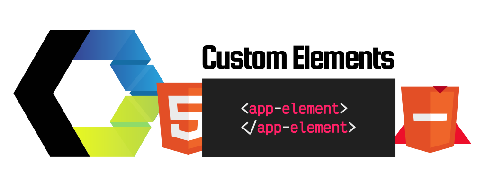
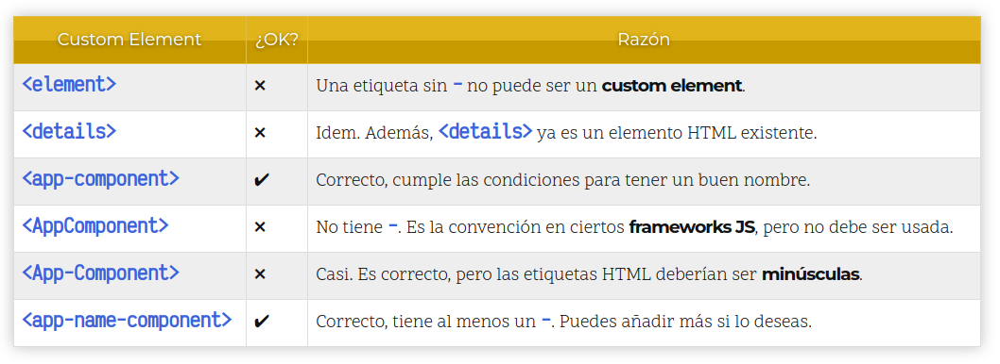
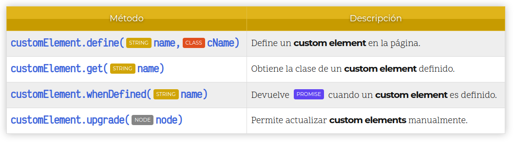
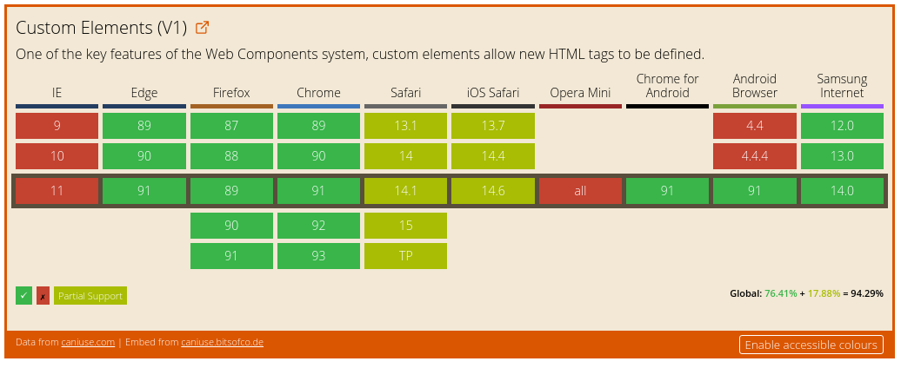

# CUSTOM ELEMENT

    Los Custom Elements (Elementos personalizados) son una de las características que forman los WebComponents, y mediante los cuales podemos crear nuestras propias etiquetas HTML de forma nativa, dotándolos de su propio marcado, funcionalidad y/o estilo.

  

## Convención de nombres 

    El estándar de HTML5 define que las etiquetas HTML oficiales deben estar formadas por una sola palabra, mientras que los custom elements (nuestras propias etiquetas) deben estar formadas de al menos 2 palabras, separadas por un - guión.

    De esta forma, protegemos nuestras páginas o aplicaciones web para que, si en el futuro se añade una nueva etiqueta HTML estándar, no tenga el mismo nombre que las nuestras.

    Así pues, un custom element básico y sencillo, podría definirse de la siguiente forma:

    <!-- Sencillo ejemplo de una etiqueta HTML propia (custom element) -->
    <app-element></app-element>

    <!-- Ejemplo incorrecto de custom element (no tiene guión) -->
    <element></element>

    Aprovechando la necesidad de utilizar dos palabras en un componente separadas por un guión, una buena práctica suele ser utilizar la primera palabra como «namespace» del componente. Es decir, utilizar el nombre de la funcionalidad, librería o aplicación, y así evitar posibles colisiones con otros elementos de terceros con nombre similar.

    También podemos darle estilo CSS al custom element, teniendo siempre en cuenta de que por defecto se trata de un elemento en línea, por lo que tenemos añadir un display diferente y darle unas dimensiones para observar cambios:

    app-element {
    display: block;
    background: steelblue;
    width: 200px;
    height: 200px;
    }

    Pero respecto a todo el tema de los estilos CSS volveremos más adelante. Centrémonos ahora en comprobar que, efectivamente, no nos estamos inventando nada. Desde Javascript, vamos a localizar los 2 custom elements anteriores (el definido correctamente y el definido incorrectamente) y vamos a comprobar que tipo de elemento son:

    // Nos devolverá que <app-element> es de tipo HTMLElement
    const appElement = document.querySelector("app-element");
    console.log("appElement: ", appElement, appElement.constructor.name);

    // Nos devolverá que <element> es de tipo HTMLUnkownElement
    const element = document.querySelector("element");
    console.log("element: ", element, element.constructor.name);

    Lo único que estamos haciendo en las lineas anteriores es, localizando ambos custom elements y accediendo a .constructor.name para que nos diga en que tipo de elemento HTML está basado.

    En el caso de <app-element> se trata efectivamente de un custom element, ya que está basado en HTMLElement, el tipo de dato base de cualquier etiqueta HTML.

    En el caso de <element> nos dice que el tipo de dato es HTMLUnknownElement, ya que al no tener guión considera que es un elemento HTML oficial, pero el navegador desconoce de que elemento se trata (es desconocido).

## Extender un HTMLElement 

    Hasta ahora hemos creado un custom element sin funcionalidad. Básicamente, lo que hemos hecho hasta ahora ha sido crear un  con un nombre diferente, que no hace nada más que contener texto u otros elementos. Exactamente lo mismo que un .

    Pero mediante Javascript, podemos crear una clase para dotar de funcionalidad a nuestro custom element. Para ello, haremos lo siguiente:

    class AppElement extends HTMLElement {
    constructor() {
        super();
        console.log("Inicializado...");
    }
    }

    customElements.define("app-element", AppElement);

    En primer lugar, hemos definido una clase llamada AppElement. Observese que es una buena práctica utilizar PascalCase para nombrar la clase, en relación al nombre que le queremos dar al custom element. Dicha clase extiende de HTMLElement, una clase que es la base de cualquier elemento HTML, por lo que al heredarla nuestro custom element va a tener todas las características que tenga un elemento HTML estándar.

    En segundo lugar, hemos definido un constructor, que no es más que un método especial que se ejecuta cada vez que se crea una nueva instancia de clase, o en nuestro contexto, cada vez que alguien define o crea una etiqueta <app-element>. En nuestro ejemplo veremos que cada vez que creamos un elemento <app-element> nos aparece el texto del console.log() en la consola JS.

    Ojo: Si defines un constructor en tu clase, no se te debe olvidar indicar el super() en el mismo, ya que es obligatorio llamar al constructor del padre si estás extendiendo de HTMLElement.

    En tercer y último lugar, no olvidar la última línea, donde llamamos a customElements.define() para indicar al navegador que existe una asociación entre el nombre de la etiqueta (primer parámetro) y la clase que implementa su funcionalidad (segundo parámetro).

    Con todo esto, y junto a métodos del DOM, podríamos comenzar a implementar funcionalidad dentro de la clase AppElement para dotar de características a nuestro custom element, como veremos en el siguiente artículo.

    // Nos devolverá que <app-element> es de tipo AppElement
    const element = document.querySelector("app-element");
    console.log("app-element: ", appElement, appElement.constructor.name);

    Ahora, si intentamos hacer esta prueba, veremos que Javascript nos dice que <app-element> es de tipo AppElement, la clase que hemos extendido.

## El registro de customElements 

    Desde el navegador, se puede hacer referencia a customElements, lo que devuelve el registro global del navegador de los custom elements cargados en la página actual. Mediante esta propiedad se pueden añadir nuevos custom elements, obtener los existentes o algunas otras operaciones relacionadas:

    Estos son los métodos disponibles para trabajar con el registro de custom elements. Vamos a verlos uno por uno, detalladamente con un ejemplo de uso.

## Definir un Custom Element 

    Mediante el método customElements.define() se puede establecer una relación entre una etiqueta HTML (custom element) y una clase que extiende obligatoriamente de HTMLElement (o de una clase relacionada). Recuerda que se recomienda siempre seguir la convención de nombres de la que hablamos previamente.

    Uncaught DOMException: Failed to execute 'define' on 'CustomElementRegistry': the name "app-element" has already been used with this registry.

    Este error parece bastante lógico y nos puede aparecer si intentamos utilizar diferentes clases para un mismo custom element. En el caso de querer dotar de múltiples funcionalidades a un mismo custom element, lo conveniente quizás sería crear una clase que herede de otras y contenga las funcionalidades buscadas, o crear diferentes custom elements.

    Uncaught DOMException: Failed to execute 'define' on 'CustomElementRegistry': this constructor has already been used with this registry`.

    Por otro lado, este error si que puede ser menos lógico e intuitivo. Si intentamos utilizar una misma clase para varios custom elements diferentes obtendremos este problema. En el caso de querer aplicar la misma clase en varios custom elements diferentes, nos bastaría con crear una nueva clase que extienda de la que queríamos usar, y así resolver dicha limitación.

## Obtener un Custom Element 

    En la mayoría de los casos, sólo necesitaremos utilizar .define() para registrar los custom elements de la página actual, pero en alguna situación concreta nos puede interesar acceder a otros custom elements ya registrados de forma manual. Para ello, podemos utilizar .get():

    class AppElement extends HTMLElement {
    /* ... */
    }
    customElements.define("app-element", AppElement);

    customElements.get("app-element") === AppElement; // true
    Como se puede ver, con .get() obtenemos la clase del custom element solicitado.

## ¿Está disponible ya? 

    Por otro lado, .whenDefined() se podría utilizar para avisarnos cuando un custom element ha sido definido en el registro de nuestra página. Esto puede ser realmente útil si queremos ejecutar acciones específicas cuando un custom element ha sido inicializado.

    Por ejemplo, analicemos el siguiente código:

    customElements.whenDefined("app-element").then(() => {
    console.log("AppElement ha sido definido");
    });
    El console.log() se ejecutará cuando la página detecte que el custom element app-element ha sido registrado y está disponible en el registro de la página, y por lo tanto, podemos realizar acciones con la seguridad de que estará definido.

## Actualización manual 

    Por último, tenemos el método .upgrade(), que se utilizaría en los casos menos frecuentes en los que queramos actualizar un custom element de forma manual. Por ejemplo, creamos un custom element previamente a haberlo definido y lo guardamos en una variable, sin conectarlo al DOM del documento.

    Veámoslo en un ejemplo:

    const element = document.createElement("app-element");

    class AppElement extends HTMLElement { /* ... */ }

    // A partir de este momento es cuando el registro conoce el custom element
    customElements.define("app-element", AppElement);

    ae.constructor === HTMLElement;   // true

    customElements.upgrade(ae);       // HTMLElement -> AppElement

    ae.constructor === HTMLElement;   // false
    ae.constructor === AppElement;    // true
    En el caso de hacer uso de .createElement() para crear el custom element antes de definirlo y no estar incluído en el documento, el elemento se queda sin actualizarse a custom element, por lo que sería necesario hacerlo manualmente (o insertarlo en el documento, para que se actualice automáticamente).

## Soporte de Custom Elements 
    Actualmente, el soporte de custom elements en los navegadores es bastante bueno, ya que a excepción de Internet Explorer y algunas características menores en Safari, el soporte es pleno en evergreen browsers:

    En el caso de querer dar soporte a Internet Explorer, existe un polyfill oficial, denominado Custom Elements (v1) Polyfill que puede llegar a implementar las características más comunes en navegadores muy antiguos u obsoletos.

