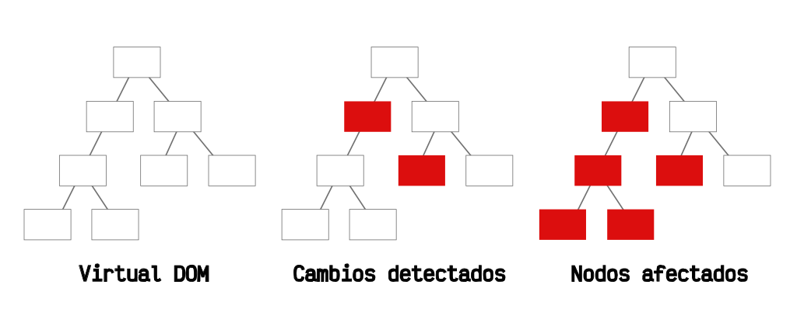

# SHADOW DOM

    Sin duda, uno de los conceptos más interesantes de WebComponents (y también más complejos de entender al principio) es el Shadow DOM (DOM en la sombra). Para entenderlo, primero debemos tener claro que el DOM es la estructura de elementos que tiene una página, estructurada en forma de árbol, donde se puede ver facilmente los descendientes (hijos) o contenedores (padres) de un elemento.

    El navegador, al cargar una página, genera esta estructura en forma de árbol, a la que generalmente llamamos DOM. Cada vez que ocurre un cambio en los elementos de una página, el navegador actualiza esta estructura para reflejarlos.

## ¿Qué es el Shadow DOM? 

    El concepto de Shadow DOM nace de la necesidad de tener una forma de encapsular elementos y mantenerlos aislados del resto de la página, creando algo así como un concepto local, en contraposición al concepto global con el que se solía trabajar en los navegadores.

    Quizás, la forma más fácil de entender el concepto de Shadow DOM, es haciendo una analogía precisamente a lo que su propio nombre indica: una sombra de un elemento.

    Imaginemos que tenemos un árbol DOM del documento de la página en la que nos encontramos. Uno de esos nodos del árbol (destacado en azul) tiene un Shadow DOM (una sombra) en la cuál puede residir otro árbol DOM, que realmente no forma parte del DOM principal de la página.

    Como veremos más adelante, entre otras cosas, esta característica nos permitiría algo muy interesante con CSS: aislar los estilos de modo que no afecten a los elementos que están fuera del Shadow DOM, ni tampoco el CSS de fuera afecte a los elementos del Shadow DOM.

    Nota: Aunque se suele asociar a WebComponents, realmente el Shadow DOM es una característica independiente que se puede aplicar a un elemento HTML normal, sin necesidad de que sea un componente.

## ¿Qué es el Virtual DOM? 

    Aunque tiene cierta relación, el concepto de virtual DOM (o VDOM) no es una alternativa directa de Shadow DOM, pero muchas veces se suelen asociar, ya que debido a sus nombres se suele intuir que son cosas similares o alternativas.

    Durante la aparición de los diferentes frameworks del ecosistema Javascript, estos idearon un concepto denominado Virtual DOM: una copia en memoria del DOM de la página, donde se gestionarían directamente los cambios del mismo, para traducirlos posteriormente al DOM real del documento, con el objetivo de acelerar y optimizar los cambios del DOM en la página.

    Por ejemplo, la popular librería React introducía el concepto de Virtual DOM para detectar los cambios (diferencias entre árboles), actualizar los nodos afectados (cambios y descendientes a quienes pueden afectar) y posteriormente, pasarlos al DOM real, consiguiendo dos cosas principales: velocidad y abstraer de estos cambios para hacerlos de forma automática y menos tediosa:

    El surgimiento del concepto de Virtual DOM y su definición, ayudó a promover el falso concepto «el DOM es lento», cuando en realidad, lo que puede hacerlo lento es la gestión que hagas (y cómo la hagas) del mismo.

    Hay que tener en cuenta también que Shadow DOM es una tecnología existente en los navegadores, mientras que Virtual DOM es un proceso que se implementa y ocurre «fuera» del navegador, en las librerías de Javascript.

## ¿Cómo utilizar Shadow DOM? 

    Por defecto, los elementos HTML no tienen Shadow DOM. Pero si queremos adjuntar y crear uno, no tenemos más que utilizar el método .attachShadow() sobre el elemento donde queramos crear el Shadow DOM.

    Método	                        Descripción
    element.attachShadow(options)	Crea y adjunta un Shadow DOM en un elemento.

    En breve explicaremos el parámetro obligatorio options y algunas características, sin embargo para empezar, con este método podríamos crear un Shadow DOM utilizando el siguiente código:

    const div = document.createElement("div");
    const shadow = div.attachShadow({ mode: "open" });

    En la primera línea creamos un elemento 
 desde Javascript. También podríamos seleccionarlo con .querySelector() o similares. En la segunda línea, creamos y adjuntamos el Shadow DOM en dicho 
, estableciéndolo en modo abierto (el más habitual). En la constante shadow guardaríamos una referencia al  generado y adjuntado en ese 
.

    Nota: No puedes adjuntar un  en cualquier tipo de elemento HTML. Sólo está permitido en componentes (custom elements), cabeceras (h1, h2, h3, h4, h5 y h6), etiquetas semánticas (article, aside, footer, header, main, nav o section), contenedores (div, span, blockquote, p) o en la propia etiqueta <body>.

## Opciones del Shadow DOM 

    El parámetro options del método .attachShadow() define las características de creación que tendrá el Shadow DOM generado. Veamos que opciones tiene para indicar:

    Opción	            Valores posibles	        Descripción
    mode	            open | closed	            Indica el modo de encapsulación del Shadow DOM. Obligatorio.
    delegatesFocus	    true | false	            Indica si el Shadow DOM debería obtener el foco.

    La opción mode define el modo de encapsulación que queremos que tenga el Shadow DOM.

    En el caso de que indiquemos modo abierto (open), el elemento en el que creamos el Shadow DOM tendrá una propiedad .shadowRoot por la cuál se puede acceder al  del elemento, y a partir de ahí, al árbol DOM que contiene:

    // Encapsulamiento abierto
    const div = document.createElement("div");
    const shadow = div.attachShadow({ mode: "open" });

    div.shadowRoot === shadow; // true, es el mismo
    En el caso de que indiquemos modo cerrado (closed), la propiedad .shadowRoot del elemento nos devolverá , siendo imposible acceder al árbol DOM que contiene. Es recomendable evitar este modo siempre que se pueda, ya que hay muy pocos casos en los que puede ser necesario:

    // Encapsulamiento cerrado
    const div = document.createElement("div");
    const shadow = div.attachShadow({ mode: "open" });

    div.shadowRoot === null; // true, no guarda referencia

    
    En cualquiera de los dos modos anteriores, .attachShadow() siempre devolvera , una referencia al Shadow DOM para acceder a su árbol interno. Esto puede ser particularmente útil en el modo cerrado, ya que .shadowRoot devuelve .

    Por último, delegatesFocus es una opción establecida a false por defecto, que indica si queremos que el propio Shadow DOM obtenga el foco o no. Esto puede ser particularmente útil cuando queremos dar estilo a través de la pseudoclase :focus.

## Encapsular CSS (Estilos locales) 

    Probablemente, una de las aplicaciones más interesantes del Shadow DOM es la de conseguir estilos CSS locales a un componente. Debido a la naturaleza global tradicional de CSS, siempre hemos creado CSS para aplicar en cascada y que afecte a todos los elementos. Y esto está bien. Es una característica deseable de diseño que bien organizada puede ahorrarnos mucho trabajo.

    Sin embargo, en algunos casos, podemos querer aplicar CSS de forma local (como solemos estar más acostumbrados en el mundo de la programación) y que los estilos solo afecten, por ejemplo, al componente donde nos encontramos. Esto permitiría simplificar muchísimo el CSS y haría mucho más sencillo trabajar con estilos en aplicaciones grandes, heredadas o con un gran número de desarrolladores en ella.

    Aquí es donde entra Shadow DOM. Por defecto, CSS seguirá teniendo el comportamiento global que ha tenido siempre, permitiendo el uso de la cascada para dar estilos. Sin embargo, gracias a este encapsulamiento podemos aislar un fragmento del DOM y que el CSS dentro del Shadow DOM no afecte al del documento, ni que este CSS global, pueda pasar y aplicarse al del Shadow DOM:

    Shadow DOM: Gandalf developer vs Balrog CSS

    Esto, llevado a código y aprovechando lo que ya sabemos de WebComponents, se puede realizar de la siguiente forma. Crearemos un componente con un Shadow DOM que en su interior contiene una etiqueta 
        

            
¡Vuelve a la sombra, CSS! ¡NO... PUEDES... PASAR!

        

        `;
    }
    });
    </script>

    Hay que tener claro que al resto de  definidos en la página HTML no se le aplicarán los estilos indicados en este componente. De la misma forma, tampoco el DOM de este componente le verá afectado por estilos definidos fuera del mismo, aunque sus selectores encajen.

    Nota: En el mundo de los frameworks de Javascript, la forma de aislar estilos en componentes más extendida es la de utilizar CSS Modules, una estrategia muy utilizada en el ecosistema Javascript, donde se cambian las clases de los elementos HTML por hashes autogenerados (usándolos a modo de namespaces) para evitar la cascada por usar nombres similares en diferentes componentes.

## Encapsular Javascript (JS local) 

    De la misma forma que hemos visto en el apartado anterior, Javascript «sufre» la misma suerte de encapsulamiento. Imaginemos la siguiente situación, junto al código anterior:

    
¡Hola a todos!

    <app-element></app-element>
    <app-element></app-element>
    <app-element></app-element>
    Ahora, en nuestro Javascript escribimos lo siguiente:

    const spans = document.querySelectorAll("span");
    Si tenemos definido un Shadow DOM como vimos en el apartado anterior, al ejecutar este código Javascript, spans contendrá un array con un sólo elemento, el todos que tenemos en nuestra página principal. Sin embargo, todos los CSS no se obtienen porque están aislados en un Shadow DOM.

    Por el contrario, si nuestro componente no estuviera aislado con un Shadow DOM sino que sólo utiliza los custom elements sin Shadow DOM como vimos en los primeros temas, obtendríamos un array con 4 elementos: el todos y los 3 CSS que se encuentran en cada componente.

    Sabiendo todo esto, podemos utilizar el encapsulamiento de CSS o Javascript a nuestro favor, y crear componentes (o elementos individuales encapsulados) dependiendo de nuestros objetivos, ya sea utilizar CSS/JS global o utilizar CSS/JS local.

    Shadow DOM Declarativo 
    Recientemente, se está popularizando la modalidad de crear un Shadow DOM de forma declarativa, es decir, desde el HTML, sin necesidad de Javascript. En esta modalidad, utilizaríamos el atributo shadowroot sobre la etiqueta <template>, pudiendo establecerlo al valor open o close, al igual que su análogo en Javascript:

    Code
    Preview
    CodePen
    <app-element>
    <template shadowroot="open">
        <slot></slot>
        <h2>I'm shadow DOM</h2>
        
    </template>
    <h2>I'm light DOM</h2>
    </app-element>

    <h2>I'm regular DOM</h2>

    Desgraciadamente, se trata de una característica experimental muy reciente y aún el soporte no está demasiado extendido. Por el momento, solo hay soporte en Chrome 88+ (o en Chrome 85+ si tienes las funcionalidades experimentales activadas).